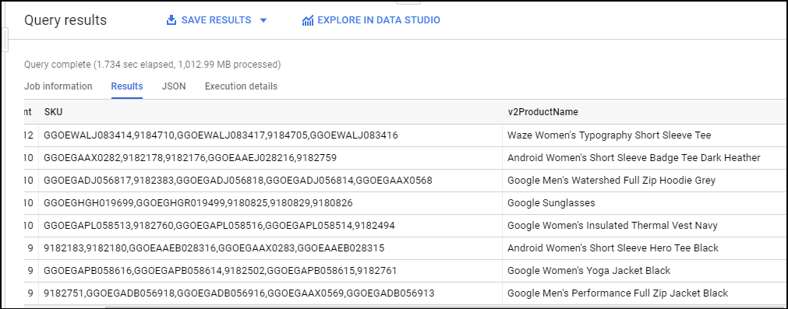

# BigQuery for Data Warehousing

## i. Creating date-partitioned tables

Common use-cases: 
Scanning through the entire dataset everytime to compare rows against a WHERE condition is wasteful. This is especially true if you only really care about records for a specific period of time like:

- All transactions for the last year
- All visitor interactions within the last 7 days
- All products sold in the last month

This will allow us to completely ignore scanning records in certain partitions if they are irrelevant to our query.

### 1. Create a new partitioned table based on date

```
CREATE OR REPLACE TABLE ecommerce.partition_by_day
 PARTITION BY date_formatted
 OPTIONS(
   description="a table partitioned by date"
 ) AS

 SELECT DISTINCT
 PARSE_DATE("%Y%m%d", date) AS date_formatted,
 fullvisitorId
 FROM `data-to-insights.ecommerce.all_sessions_raw`

```

> Confirm that you see:
> 
> - Partitioned by: Day
> - Partitioning on: date_formatted

### 2a. Creating an auto-expiring partitioned table

- Auto-expiring partitioned tables are used to comply with data privacy statutes, and can be used to avoid unnecessary storage (which you'll be charged for in a production environment). If you want to create a rolling window of data, add an expiration date so the partition disappears after you're finished using it.

To create a table that:

- Queries on weather data from 2018 onward
- Filters to only include days that have had some precipitation (rain, snow, etc.)
- Only stores each partition of data for 90 days from that partition's date (rolling window)

```
 SELECT
   DATE(CAST(year AS INT64), CAST(mo AS INT64), CAST(da AS INT64)) AS date,
   (SELECT ANY_VALUE(name) FROM `bigquery-public-data.noaa_gsod.stations` AS stations
    WHERE stations.usaf = stn) AS station_name,  -- Stations may have multiple names
   prcp
 FROM `bigquery-public-data.noaa_gsod.gsod*` AS weather
 WHERE prcp < 99.9  -- Filter unknown values
   AND prcp > 0      -- Filter stations/days with no precipitation
   AND CAST(_TABLE_SUFFIX AS int64) >= 2018
 ORDER BY date DESC -- Where has it rained/snowed recently
 LIMIT 10
```
>  Note that the table wildcard * used in the FROM clause to limit the amount of tables referred to in the TABLE_SUFFIX filter.


To create a date-partitioned table with  partition_expiration_days = 60 and add the table description = "weather stations with precipitation, partitioned by day"

```
 CREATE OR REPLACE TABLE ecommerce.days_with_rain
 PARTITION BY date
 OPTIONS (
   partition_expiration_days=60,
   description="weather stations with precipitation, partitioned by day"
 ) AS


 SELECT
   DATE(CAST(year AS INT64), CAST(mo AS INT64), CAST(da AS INT64)) AS date,
   (SELECT ANY_VALUE(name) FROM `bigquery-public-data.noaa_gsod.stations` AS stations
    WHERE stations.usaf = stn) AS station_name,  -- Stations may have multiple names
   prcp
 FROM `bigquery-public-data.noaa_gsod.gsod*` AS weather
 WHERE prcp < 99.9  -- Filter unknown values
   AND prcp > 0      -- Filter
   AND CAST(_TABLE_SUFFIX AS int64) >= 2018
```

### 2b. Confirm data partition expiration is working

To confirm you are only storing data from 60 days in the past up until today, run the DATE_DIFF query to get the age of your partitions, which are set to expire after 60 days.

```
# avg monthly precipitation
SELECT
  AVG(prcp) AS average,
  station_name,
  date,
  CURRENT_DATE() AS today,
  DATE_DIFF(CURRENT_DATE(), date, DAY) AS partition_age,
  EXTRACT(MONTH FROM date) AS month
FROM ecommerce.days_with_rain
WHERE station_name = 'WAKAYAMA' #Japan
GROUP BY station_name, date, today, month, partition_age
ORDER BY date DESC; # most recent days first
```
> output


### 2c. Confirm the oldest partition_age is at or below 60 days
Update the ORDER BY clause to show the oldest partitions first
```
ORDER BY partition_age DESC
```

## ii. Troubleshooting and Solving Data Join Pitfalls

### Examine relationship between SKU & Name

STRING_AGG() function to aggregate all the product SKUs that are associated with one product name into comma separated values.

SELECT
  v2ProductName,
  COUNT(DISTINCT productSKU) AS SKU_count,
  STRING_AGG(DISTINCT productSKU LIMIT 5) AS SKU
FROM `data-to-insights.ecommerce.all_sessions_raw`
  WHERE productSKU IS NOT NULL
  GROUP BY v2ProductName
  HAVING SKU_count > 1
  ORDER BY SKU_count DESC



### Pitfall: non-unique key

### Join pitfall: Unintentional many-to-one SKU relationship
e.g.more than one product name (like 7" Dog Frisbee) that can share a single SKU.

> solution: use distinct SKUs before joining

- gather all the possible names into an array. 
- instead of having a row for every Product Name, we only have a row for each unique SKU.

```
SELECT
  productSKU,
  ARRAY_AGG(DISTINCT v2ProductName) AS push_all_names_into_array
FROM `data-to-insights.ecommerce.all_sessions_raw`
WHERE productSKU = 'GGOEGAAX0098'
GROUP BY productSKU
```


- to deduplicate the product names, you could even LIMIT the array

```
SELECT
  productSKU,
  ARRAY_AGG(DISTINCT v2ProductName LIMIT 1) AS push_all_names_into_array
FROM `data-to-insights.ecommerce.all_sessions_raw`
WHERE productSKU = 'GGOEGAAX0098'
GROUP BY productSKU

```


### Join pitfall: Losing data records after a join

> solution: LEFT JOIN + RIGHT JOIN = FULL JOIN which returns all records from both tables regardless of matching join keys. You then filter out where you have mismatches on either side

```
SELECT DISTINCT
website.productSKU AS website_SKU,
inventory.SKU AS inventory_SKU
FROM `data-to-insights.ecommerce.all_sessions_raw` AS website
FULL JOIN `data-to-insights.ecommerce.products` AS inventory
ON website.productSKU = inventory.SKU
WHERE website.productSKU IS NULL OR inventory.SKU IS NULL
```

## iii. Data Catalog

Use case: 

- When a new dataset comes in, you annotate it with important information—this could be whether or not it contains PII data, who owns the dataset, how many rows the dataset contains, etc.
- Data Catalog allows you to **create tag templates** to let you define what kind of attributes you want to tag. This allows you to easily **access, map, and discover pertinent information from your datasets and tables**.

This lab shows how we can enable the Data Catalog API so that you can use this service in your Google Cloud project.

## iv. Build and Execute MySQL, PostgreSQL, and SQLServer to Data Catalog Connectors