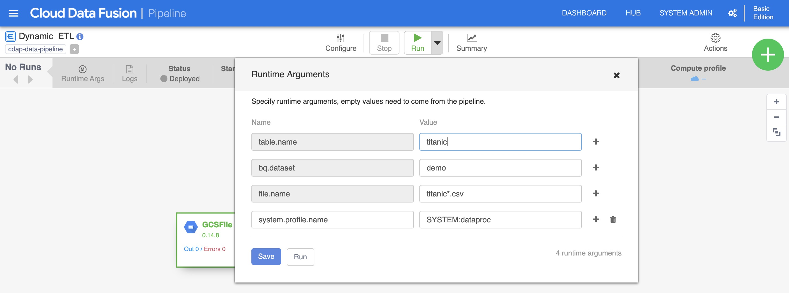

## Building Dynamic Pipelines in Cloud Data Fusion Using Macros

In Data Fusion, you can use [Macros](https://docs.cdap.io/cdap/current/en/user-guide/pipelines/creating-pipelines.html#H2230) to introduce dynamic variables for plugin configurations so that you can specify the variable substitutions at runtime.

**Use case for macros**

- to allow for variable substitution when the pipeline is run, so instead of using hard coded paths, you could use dynamic paths. This way you’re able to specify which particular file you want to process when the pipeline is invoked. In addition to macros you'll use wildcards as well.

## Create a simple batch pipeline

## Modify the batch pipeline to use Macros for certain plugin configurations

### Dynamic loading and writing data
Aim: take a sequence of files, [titanic1.csv, titanic2.csv, …, titanincN.csv] that you copied into your Cloud Storage bucket, and load them all through the same pipeline and apply the same transformations in parallel.

Set Path as: gs://YOUR-BUCKET-NAME/incremental/${file.name}

## Deploy the dynamic pipeline and run it using runtime arguments

> In order to process all the CSV files, you specify the file name and use a wildcard * to read all the files that begin with titanic and end with .csv. This will selectively read only the titanic files and filter out any other CSV files that may exist in that directory. Optionaly, if you only have CSV files in that directory you can simply set the value to an asterisk ( * ) or a forward slash ( / ) and read all the files in the directory.